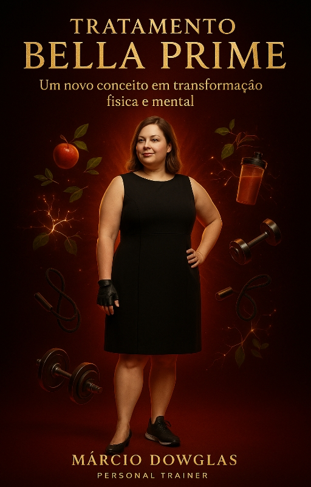
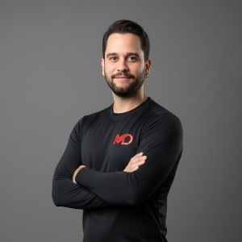

<!-- define idioma para hifenização -->

<!-- CAPA (página 1, A4 cheia) -->

  

<!-- SUMÁRIO (página 2) -->

# Sumário
1. O Início de Tudo  
2. O Que é o Tratamento Bella Prime  
3. Os Níveis da Jornada  
4. O Poder da Neurociência  
5. A Nutrição que Sustenta Resultados  
6. O Treino como Ferramenta de Identidade  
7. A Mente, o Corpo e o Propósito  

---

# 1. O Início de Tudo

Sabe quando você olha no espelho e percebe que o corpo até quer mudar, mas a mente não acompanha? Foi observando isso, por anos, que nasceu o Bella Prime.

Eu vim da natação. Ali entendi algo que virou chave: o corpo fala o que a mente sente.

Quando migrei para a musculação, vi que o treino transformava mais a cabeça do que o físico. Ficou claro: não adianta tratar só o corpo. Comportamento vem primeiro.

O Bella Prime é a resposta para isso. Não é um treino a mais. É um tratamento: um método que muda sua relação com o corpo, com a comida e com a disciplina.

  <h3>“O corpo muda quando a mente entende o propósito.”</h3>

---

# 2. O Que é o Tratamento Bella Prime

O Bella Prime é um processo de evolução física e mental dividido em níveis. Cada fase prepara você para a seguinte, sem pressa, sem culpa e sem cobrança vazia.

O método une treino, nutrição e neurociência aplicada para transformar comportamento. Não é sobre perder peso rápido. É sobre construir constância.

Não adianta ir com tudo por uma semana e desistir no mês seguinte. Aqui você aprende a fazer o corpo seguir a mente, e não o contrário.

  <h3>“Não é sobre estética. É sobre consciência.”</h3>

---

# 3. Os Níveis da Jornada

Fundação — o início.  
Base, disciplina e reaprendizado do movimento. Você reconstrói rotina e recupera confiança.

Ascensão — aceleração.  
Mais força, mais foco, mais energia. O treino ganha intensidade e a mente acompanha com clareza.

Domínio — equilíbrio.  
Corpo, alimentação e mente falando a mesma língua. Você treina por prazer, não por obrigação.

E existe o nível oculto: OverPrime.  
É quando você domina a si mesma: corpo, mente e comportamento em harmonia.

---

# 4. O Poder da Neurociência

Toda mudança começa no cérebro. Antes do corpo agir, o cérebro decide se vale a pena.

Muita gente desiste porque tenta mudar o corpo antes de mudar a mente. Aqui, a ordem é inversa: primeiro ensinamos o cérebro a gostar do processo.

Você transforma esforço em prazer, treino em hábito e resultado em consequência. Não é força de vontade. É automatização do progresso.

---

# 5. A Nutrição que Sustenta Resultados

Dieta não é castigo. A nutrição do Bella Prime é equilíbrio, praticidade e bem-estar.

Não cortamos o que você ama. Ensinamos você a comer com consciência, sem culpa e sem exageros.

O problema não é comer o que gosta, e sim comer sem propósito. Com estratégia, a alimentação vira energia e prazer, e sustenta seus treinos.

---

# 6. O Treino como Ferramenta de Identidade

Treinar não é só queimar calorias. É construir identidade.

Toda vez que você vai, mesmo sem vontade, prova algo para si. Essa repetição cria confiança.

O treino, no Bella Prime, é um ritual. É o momento de silenciar o mundo e se conectar com a mulher que você está se tornando. Você treina para ser, não para caber.

---

# 7. A Mente, o Corpo e o Propósito

O Bella Prime é um convite ao equilíbrio: o corpo que você tem, a mulher que deseja ser e a ponte entre as duas.

É dominar pensamentos, regular emoções e permitir que o corpo reflita essa nova versão.

A mulher que passa pelo Bella Prime entende: o trono não é o destino. É o reflexo de quem aprendeu a reinar sobre si.

---

# Sobre o Autor

  

    <!-- Suba sua foto como ./autor.jpg -->
    
  

  

    <h3><strong>Márcio Dowglas — Personal Trainer</strong></h3>
    

      Profissional de Educação Física (CREF 003918-G/AM), há mais de dez anos unindo treinamento de força,
      nutrição prática e neurociência aplicada à mudança de comportamento. Criador do Tratamento Bella Prime™
      e do Sistema Evo360°.
    

    

      <h3>Missão</h3>
      <ul class="author-highlights">
        <li>Unir treino e neurociência para resultados sustentáveis.</li>
        <li>Transformar conhecimento em prática diária com hábitos acionáveis.</li>
        <li>Oferecer guias e utilitários que facilitam a rotina de quem treina.</li>
      </ul>
    

    

      <h3>Como eu trabalho</h3>
      <ul class="author-highlights">
        <li>Periodização em níveis: Fundação → Ascensão → Domínio (e o nível oculto OverPrime).</li>
        <li>Treino de força para mulheres e recomposição corporal.</li>
        <li>Nutrição prática: consciência alimentar, consistência e prazer em comer.</li>
      </ul>
    

    

      
<strong>Próximo passo:</strong> faça sua avaliação inicial gratuita e receba uma orientação personalizada.

      
Instagram: @marciodowglasfitness · WhatsApp: (insira aqui)

    

    
— Márcio Dowglas, Personal Trainer

  

 <!-- /lang -->